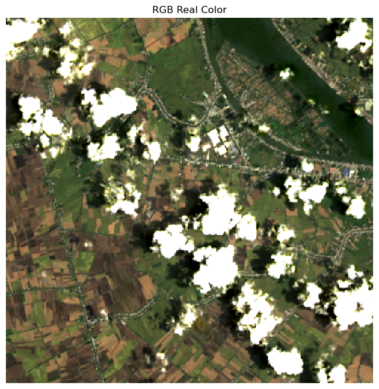
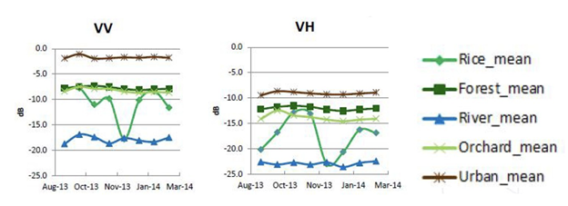
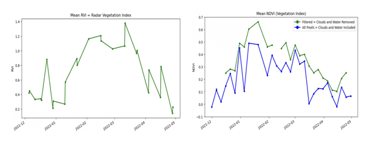
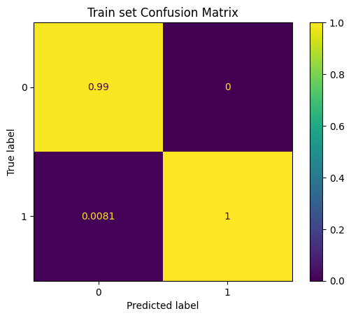
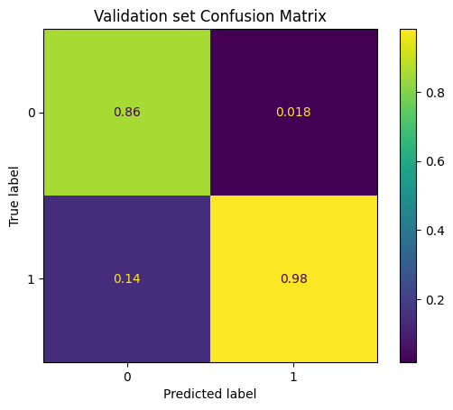
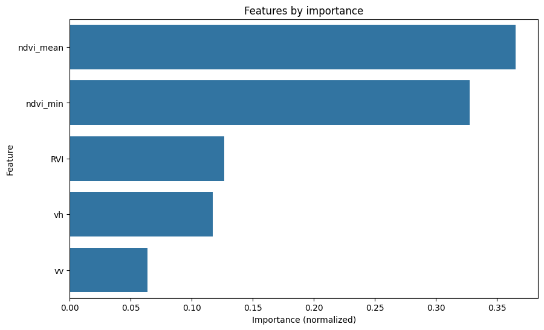
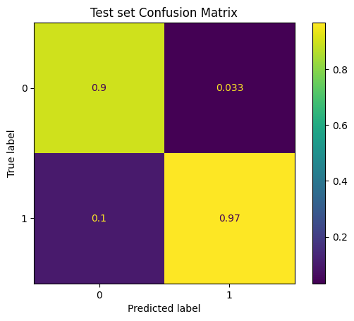
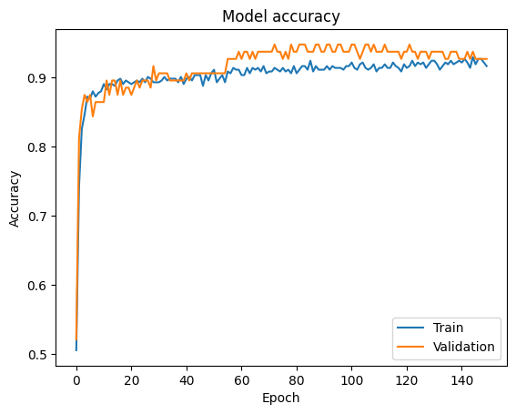
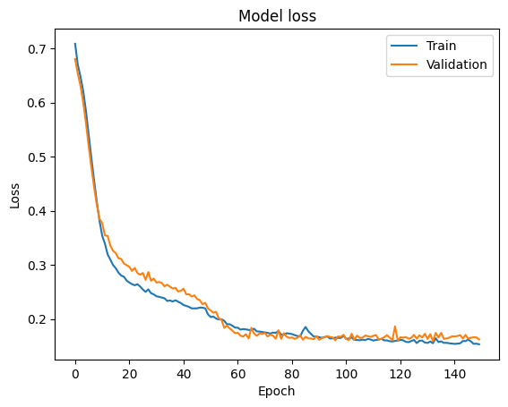

# EY Open Science Data Challenge 2023

## Overview

The EY Open Science Data Challenge 2023 offers participants the opportunity to tackle two levels of challenges focused on leveraging satellite data to track and predict rice crop presence and yield. The challenges utilize optical and radar data from the European Copernicus and NASA's Landsat programs, providing a rich dataset for analysis.

## Project Goals

The primary goals of the challenge are to:

Predict the presence or absence of rice crops in a given location using satellite images.

## Dataset

The dataset includes satellite data from the European Copernicus (Sentinel-1 and Sentinel-2) program and NASA's Landsat program, covering the An Giang province in the Mekong Delta, Vietnam. It encompasses rice crop yield data collected over specific districts for the late-2021 to mid-2022 period.

<p align="center">
	
</p>

## Preprocessing Steps

The preprocessing steps involve extracting meaningful information from optical and radar data, particularly focusing on indices like NDVI (Normalized Difference Vegetation Index), RVI (Radar Vegetation Index), and radar backscatter values (VV and VH bands).

### Radar Data (Sentinel-1)

- **VV (Vertical-Vertical) and VH (Vertical-Horizontal) Bands:** These bands measure backscatter values at different polarizations, reflecting variations in crop structure and stage of growth. VV is sensitive to the vertical structure of vegetation, while VH responds to both vegetation and soil properties.

<p align="center">
	
</p>

### Optical Data (Sentinel-2 and Landsat)

- **NDVI (Normalized Difference Vegetation Index):** Calculated from the difference between the near-infrared (NIR) and red bands, NDVI provides insights into vegetation health and density, aiding in crop identification and growth monitoring.
- **RVI (Radar Vegetation Index):** Analogous to NDVI but derived from radar data, RVI captures variations in vegetation structure and biomass, offering complementary information to optical indices.

<p align="center">
	
</p>

## Models Used

The models considered include:

### Random Forest

#### Confusion Matrix

<p align="center">
  
&nbsp; &nbsp; &nbsp; &nbsp;
  
</p>

#### Feature importance

<p align="center">
	
</p>

### Neural Network

```
Dense(64, activation='relu')
Dense(32, activation='sigmoid')
Dense(16, activation='relu')
Dense(2, activation='sigmoid')
```

<p align="center">
	
</p>

<p align="center">
  
&nbsp; &nbsp; &nbsp; &nbsp;
  
</p>

## Repository Structure

- `data/`: Contains raw and processed datasets.
- `docs/`: Visualizations of the project setting and specific data.
- `results/`: Includes visualizations and evaluation metrics.
- `src/`: Jupyter notebooks for data exploration, preprocessing, model training, and evaluation.
- `README.md`: Overview of the project.
- `requirements.txt`: Python libraries requirements list.

## Future Work

Future work includes:

- Implementing more advanced machine learning models.
- Enhancing data preprocessing techniques.
- Exploring additional satellite datasets for improved accuracy.
